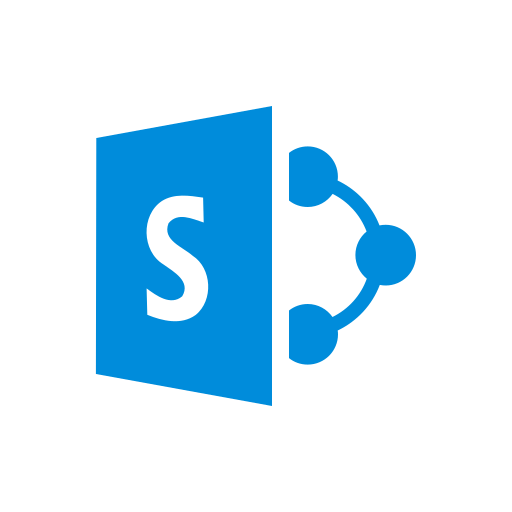

# awesome-sharepoint-framework 

 > Useful resources for creating apps with the [SharePoint Framework](https://docs.microsoft.com/en-us/sharepoint/dev/spfx/sharepoint-framework-overview)
 

 #### Table of Contents
* [Apps](#apps)
* [Tools](#tools)
* [Documentation](#documentation)
* [Articles](#articles)
* [Videos](#videos)
* [Community](#community)
* [Tips](#tips)
* [Contribute](#contribute)

## Apps

### Open Source
* [react-handlebars-search](https://github.com/estruyf/react-handlebars-search) - This web part is created to allow you to visualize search results by using custom Handlebars templates.

### Closed Source

### Samples
* [Microsoft webparts](https://github.com/SharePoint/sp-dev-fx-webparts) - Microsoft-developed web part samples with various implementations, such as angular1+2, jquery, react, knockout, vue.
* [Microsoft extensions](https://github.com/SharePoint/sp-dev-fx-extensions) - Samples and tutorial code around SharePoint Framework Extensions
* [Microsoft React controls](https://github.com/SharePoint/sp-dev-fx-controls-react) - Reusable content controls for SharePoint Framework solutions build with React
* [Microsoft property pane controls](https://github.com/SharePoint/sp-dev-fx-property-controls) - Reusable property pane controls to be used in web parts
* [Microsoft reusable solutions](https://github.com/SharePoint/sp-dev-solutions) - Repository for more polished and fine-tuned reusable solutions build with SharePoint Framework
* [Microsoft Visual Studio IDE extensions](https://github.com/SharePoint/sp-dev-fx-vs-extension) - Open source Visual Studio IDE extension for creating SharePoint Framework solutions in the Visual Studio 2015 or 2017

## Tools
* [PnP-JS-Core](https://github.com/SharePoint/PnP-JS-Core) - Help developers by simplifying common operations within SharePoint and the SharePoint Framework. Currently it contains a fluent API for working with the full SharePoint REST API as well as utility and helper functions.
* [docker-spfx](https://github.com/waldekmastykarz/docker-spfx) - Docker images for working with SharePoint Framework
* [gulp-spsync](https://github.com/wictorwilen/gulp-spsync) - Gulp plugin for synchronizing local files with a SharePoint library
* [gulp-spsync-creds](https://github.com/estruyf/gulp-spsync-creds) - Gulp plugin for synchronizing local files with a SharePoint library via user credentials
* [SPCAF](https://rencore.com/products/spcaf/) - Validate your SharePoint on-premises and Online customizations ([yoeman generator](https://github.com/rencoreab/generator-spcaf) for Sharepoint Framework task automation) :heavy_dollar_sign:

## Documentation
* [Getting Started](https://docs.microsoft.com/en-us/sharepoint/dev/spfx/set-up-your-developer-tenant)
* [Official Documentation](https://docs.microsoft.com/en-us/sharepoint/dev/spfx/sharepoint-framework-overview)
* [Github repo](https://github.com/SharePoint/sp-dev-docs)

## Articles
* [Building shared code in SharePoint Framework - revisited](https://blog.mastykarz.nl/building-shared-code-sharepoint-framework-revisited/) - When done correctly, shared code is loaded only once for each page by the SharePoint Framework. And if there are multiple web parts on the same page using it, they will not only load faster due to smaller bundle sizes but also due to the shared code being executed only once.
* [Build multi-page SharePoint Framework client-side web parts with Angular v1.x](https://blog.mastykarz.nl/build-multi-page-sharepoint-framework-client-side-web-parts-angular/) - When building SharePoint Framework web parts using Angular you might need to implement multiple views. Here is how to do it without breaking other web parts on the page.
* [Automate publishing of your SharePoint Framework solution package deployment](https://www.eliostruyf.com/automate-sharepoint-framework-solution-package-deployment/) - How to automate solution package upload process. No more manual upload of files and app package.
* [Correctly reference images in SharePoint Framework solutions](https://www.google.com/amp/s/blog.mastykarz.nl/correctly-reference-images-sharepoint-framework-solutions/amp/) - By changing the default configuration of webpack, you can have all image URLs point to the correct location without changing anything about your code.

## Videos
* [PnP - Debugging Sharepoint Framework Solutions in Visual Studio Code](https://youtu.be/oNChcluMrm8)
* [PnP - Exclude libraries from SharePoint Framework bundles](https://youtu.be/-5cXhenHKNk)

## Community
* [Slack](https://officedevslack.azurewebsites.net)
* [Stack Exchange](http://sharepoint.stackexchange.com/) - Microsoft monitors hashtags `#spfx`, `#spfx-webparts`, and `#spfx-tooling`
* [@SharePoint](https://twitter.com/sharepoint), [@OfficeDev](https://twitter.com/officedev) and [@OfficeDevPnP](https://twitter.com/officedevpnp) on Twitter
* [User Voice](https://sharepoint.uservoice.com/forums/329220-sharepoint-dev-platform)
* [MS Developer Community](https://techcommunity.microsoft.com/t5/SharePoint-Developer/bd-p/SharePointDev)
* [Monthly PnP Conference Call - Download ics](http://aka.ms/sppnp-call) - 2nd Tuesday of each month at 5 PM CET / 8 AM PST

## Tips
Contribute some ;)

## Contribute
Contributions welcome! Read the [contribution guidelines](contributing.md) first.

## License

To the extent possible under law, [Brian Kennedy](https://github.com/bpkennedy) has waived all copyright and related or neighboring rights to this work.
